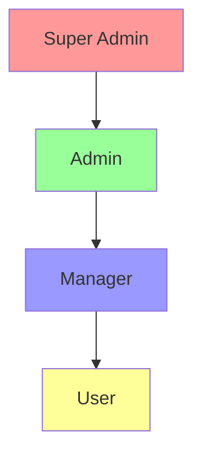

# RBAC Implementation for this Project

This is the current implementation of Role-Based Access Control (RBAC) for this project.

## Current Implementation

### Database Schema

```sql
// From lib/db/migrations/0000_soft_the_anarchist.sql
enum role_enum {
  OWNER,
  MEMBER,
}
table users {
  id uuid pk
  role role_enum
  // other fields...
}
```

### Current Limitations

1. **Basic Role Structure**

   - Only implements basic OWNER/MEMBER roles
   - Missing granular permissions
   - No role hierarchy implementation
   - No role-permission mapping table

2. **Authorization Logic**
   - Basic middleware checks only for authentication
   - Missing role-based route protection
   - No permission-based access control

## Required Updates

### Database Schema Changes

1. **New Tables Needed**

```sql
CREATE TABLE roles (
  id UUID PRIMARY KEY DEFAULT uuid_generate_v4(),
  name VARCHAR(50) NOT NULL UNIQUE,
  description TEXT,
  created_at TIMESTAMP WITH TIME ZONE DEFAULT CURRENT_TIMESTAMP,
  updated_at TIMESTAMP WITH TIME ZONE DEFAULT CURRENT_TIMESTAMP
);

CREATE TABLE permissions (
  id UUID PRIMARY KEY DEFAULT uuid_generate_v4(),
  name VARCHAR(50) NOT NULL UNIQUE,
  description TEXT,
  created_at TIMESTAMP WITH TIME ZONE DEFAULT CURRENT_TIMESTAMP
);

CREATE TABLE role_permissions (
  role_id UUID REFERENCES roles(id),
  permission_id UUID REFERENCES permissions(id),
  PRIMARY KEY (role_id, permission_id)
);

-- Update users table
ALTER TABLE users
DROP COLUMN role,
ADD COLUMN role_id UUID REFERENCES roles(id);
```

### Required TypeScript Types

```typescript
interface Permission {
  id: string;
  name: string;
  description?: string;
  created_at: Date;
}
interface Role {
  id: string;
  name: string;
  description?: string;
  permissions: Permission[];
  created_at: Date;
  updated_at: Date;
}
interface User {
  id: string;
  role: Role;
  // other fields...
}
```

### Middleware Updates Needed

**Need to implement**

```typescript
// From lib/auth/middleware.ts
// Need to implement permission-based middleware
export const withPermission = (permission: string) => {
  return async (req: Request) => {
    const user = await getCurrentUser(req);
    if (!user?.role?.permissions?.includes(permission)) {
      throw new Error("Unauthorized");
    }
    return user;
  };
};
// Need to implement role-based middleware
export const withRole = (allowedRoles: string[]) => {
  return async (req: Request) => {
    const user = await getCurrentUser(req);
    if (!allowedRoles.includes(user?.role?.name)) {
      throw new Error("Unauthorized");
    }
    return user;
  };
};
```

## Implementation Roadmap

### Phase 1: Database Migration

1. Create new roles and permissions tables
2. Migrate existing user roles
3. Add necessary indexes
4. Add audit logging for role changes

### Phase 2: Core RBAC Logic

1. Implement role hierarchy
2. Create permission checking utilities
3. Update authentication middleware
4. Add role-based route protection

### Phase 3: UI Components

1. Role management interface
2. Permission management interface
3. User role assignment interface
4. Role-based component rendering

### Phase 4: API Implementation

1. Role CRUD endpoints
2. Permission CRUD endpoints
3. User role assignment endpoints
4. Role-permission mapping endpoints

## Best Practices to Implement

### Security

1. **Principle of Least Privilege**

   - Assign minimal required permissions
   - Regular permission audits
   - Automated role review processes

2. **Access Control**
   - Implement session management
   - Add request rate limiting
   - Add brute force protection

### Performance

1. **Caching**

   - Cache user permissions
   - Cache role hierarchies
   - Implement cache invalidation

2. **Database**
   - Optimize role-permission queries
   - Add proper indexes
   - Implement connection pooling

### Monitoring

1. **Audit Logging**

   - Log role changes
   - Log permission changes
   - Log access denials

2. **Analytics**
   - Track permission usage
   - Monitor role distribution
   - Track authorization failures

## Known Issues

1. **Current Implementation**

   - Basic role enum is too limiting
   - Missing permission granularity
   - No audit trail for role changes
   - Missing role hierarchy

2. **Security Concerns**
   - No permission inheritance
   - Missing role validation
   - Incomplete access control
   - No session management

## Future Enhancements

1. **Advanced Features**

   - Dynamic role creation
   - Custom permission creation
   - Time-based role assignments
   - Location-based permissions

2. **UI Improvements**

   - Role management dashboard
   - Permission visualization
   - Role hierarchy diagram
   - Access control matrix

3. **Integration**
   - SSO integration
   - External role providers
   - API access control
   - Third-party service integration

## Testing Requirements

1. **Unit Tests**

   - Role assignment logic
   - Permission checking
   - Middleware functionality
   - Database operations

2. **Integration Tests**

   - Role-based access flows
   - Permission inheritance
   - API endpoints
   - UI components

3. **E2E Tests**
   - Complete user flows
   - Role management scenarios
   - Permission scenarios
   - Error handling

## Role Hierarchy



## Implementation Files

### Database Files

1. **lib/db/migrations/0000_soft_the_anarchist.sql**

```sql
-- Role enum and base tables
CREATE TYPE role_enum AS ENUM ('OWNER', 'MEMBER');
CREATE TABLE users (
  id UUID PRIMARY KEY DEFAULT uuid_generate_v4(),
  role role_enum NOT NULL DEFAULT 'MEMBER',
  // other fields...
);
```

### Authentication & Authorization Files

1. **lib/auth/middleware.ts**

```typescript
// Middleware for role-based route protection
import { NextResponse } from "next/server";
import { getSession } from "./session";
export async function withRole(role: string[]) {
  return async function middleware(req: Request) {
    const session = await getSession();
    if (!session || !role.includes(session.user.role)) {
      return NextResponse.redirect("/unauthorized");
    }
    return NextResponse.next();
  };
}
```

2. **lib/auth/session.ts**

```typescript
// Session management with role information
import { cookies } from "next/headers";
import { jwtVerify } from "jose";
export async function getSession() {
  const token = cookies().get("token");
  if (!token) return null;
  try {
    const verified = await jwtVerify(token.value, secret);
    return verified.payload;
  } catch {
    return null;
  }
}
```

3. **lib/auth/index.tsx**

```typescript
// Main auth context and hooks
import { createContext, useContext } from "react";
interface AuthContext {
  user: User | null;
  role: string;
  permissions: string[];
}
export const AuthContext = createContext<AuthContext | null>(null);
export function useAuth() {
  return useContext(AuthContext);
}
export function useRole() {
  const auth = useAuth();
  return auth?.role;
}
export function usePermissions() {
  const auth = useAuth();
  return auth?.permissions ?? [];
}
```

### UI Components

1. **components/ui/role-gate.tsx**

```typescript
// Component for role-based UI rendering
interface RoleGateProps {
  allowedRoles: string[];
  children: React.ReactNode;
}
export function RoleGate({ allowedRoles, children }: RoleGateProps) {
  const role = useRole();
  if (!role || !allowedRoles.includes(role)) {
    return null;
  }
  return <>{children}</>;
}
```

## Usage Examples

### Protecting Routes

```typescript
// app/admin/page.tsx
import { withRole } from "@/lib/auth/middleware";
export const middleware = withRole(["ADMIN", "OWNER"]);
```

### Protecting UI Elements

```typescript
// components/admin-panel.tsx
import { RoleGate } from "@/components/ui/role-gate";
export function AdminPanel() {
  return (
    <RoleGate allowedRoles={["ADMIN", "OWNER"]}>
      <div>Admin only content</div>
    </RoleGate>
  );
}
```

### Protecting API Routes

```typescript
// app/api/admin/route.ts
import { withRole } from "@/lib/auth/middleware";
export const POST = withRole(["ADMIN"])(async (req) => {
  // Admin only API logic
});
```

## Required Dependencies

```json
{
  "dependencies": {
    "jose": "^4.14.4",
    "next": "^13.4.0",
    "react": "^18.2.0",
    "react-dom": "^18.2.0"
  }
}
```

## Implementation Steps

1. **Database Setup**

   - Copy the SQL migration file
   - Run the migration
   - Set up role enum types

2. **Auth Setup**

   - Copy auth middleware files
   - Copy session management
   - Set up auth context

3. **UI Components**

   - Copy role-gate component
   - Implement in your components

4. **Environment Variables**

```env
AUTH_SECRET=your_secret_here
```

## Best Practices

1. **Role Definition**

   - Keep roles simple and hierarchical
   - Use enum types for roles
   - Document role permissions

2. **Security**

   - Always verify roles server-side
   - Never trust client-side role checks
   - Implement proper session management

3. **Performance**
   - Cache role checks where possible
   - Use middleware for route protection
   - Implement proper error handling

## Future Improvements

1. **Advanced Features**

   - Dynamic role creation
   - Custom permission creation
   - Time-based role assignments
   - Location-based permissions

2. **UI Improvements**

   - Role management dashboard
   - Permission visualization
   - Role hierarchy diagram
   - Access control matrix

3. **Integration**
   - SSO integration
   - External role providers
   - API access control
   - Third-party service integration

## Testing Requirements

1. **Unit Tests**

   - Role assignment logic
   - Permission checking
   - Middleware functionality
   - Database operations

2. **Integration Tests**

   - Role-based access flows
   - Permission inheritance
   - API endpoints
   - UI components

3. **E2E Tests**
   - Complete user flows
   - Role management scenarios
   - Permission scenarios
   - Error handling
